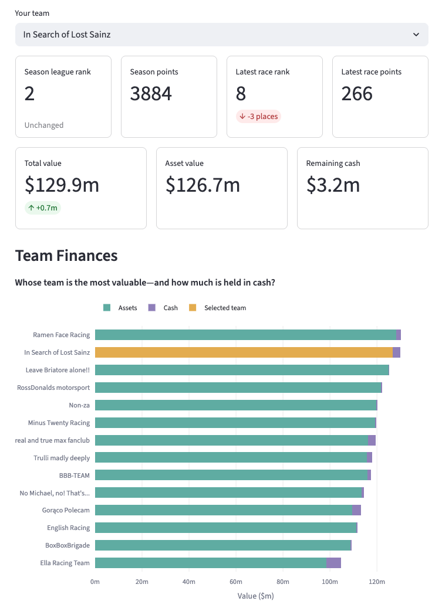
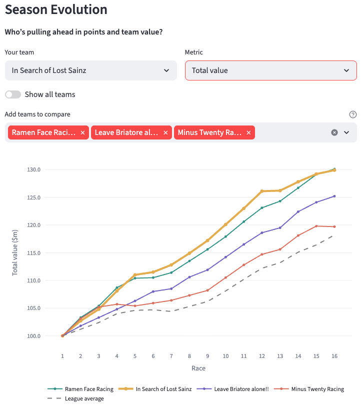
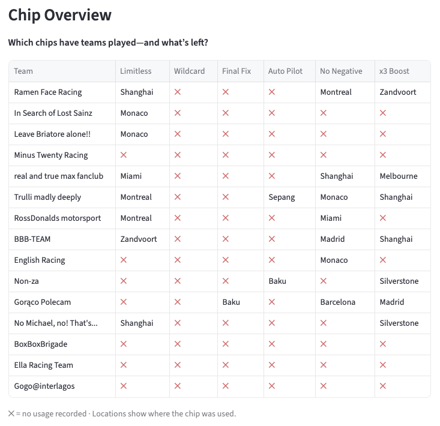

# F1 Fantasy Analytics

A data analytics project for exploring F1 Fantasy league performance in more detail than is available through the official application interface.

The project uses F1 Fantasy data to reconstruct league and team history and make comparisons that would otherwise require manual calculations. This includes team value and growth, chip usage, team composition and race-by-race performance.

The project is intended for personal analysis of leagues in which the user participates.

## Pipeline overview

The project separates data collection, preparation, database loading and analytical modelling.

```text
F1 Fantasy API (public + authenticated)
              ↓
     Data collection (JSON)
              ↓
     Data preparation (CSV)
              ↓
     SQLite source tables
       + data validation
              ↓
      SQL analytical marts
              ↓
            FastAPI
              ↓
           Streamlit
```

Raw API responses are preserved separately from processed datasets. The SQLite source tables retain the collected data, while analytical marts combine datasets and calculate additional metrics for the application.

## Data collection architecture

The project combines public F1 Fantasy league data with authenticated opponent-team endpoints.

Public league standings provide team identifiers, rankings, race points and selections. These identifiers are used to retrieve more detailed historical data, including captain selections, team finances, substitutions, chip usage and overall performance.

The authenticated data allows the project to analyse information that is available in F1 Fantasy but difficult to compare across teams and races using the official interface.

## Project structure

```text
f1-fantasy-analytics/
├── api/                 # FastAPI endpoints
├── app/                 # Streamlit dashboard
├── data/                # Reference files and local data
├── docs/                # Documentation and screenshots
├── notebooks/           # Exploratory work
├── scripts/             # Data collection and preparation
├── sql/                 # Analytical marts
├── src/                 # Reusable Python modules
├── requirements.txt
└── run_pipeline.py
```

### Data layers

- **`data/raw/`** — original API responses stored as JSON.
- **`data/processed/`** — cleaned and structured CSV datasets.
- **SQLite** — relational source tables and analytical marts.
- **`data/reference/`** — version-controlled race and Fantasy chip metadata.

Raw and processed data, local databases and private notebooks are excluded from Git.

## Analytical marts

SQL marts prepare the datasets used by the API and dashboard:

- **`mart_team_race`** — race-by-race team points, cumulative points, financial values, changes in total value and league averages.
- **`mart_team_chips`** — chip usage, availability, activation races and race performance, using each team's latest available snapshot.
- **`mart_team_assets_latest`** — team selections in the latest loaded race, enriched with driver and constructor data.
- **`mart_assets_latest`** — latest available driver and constructor prices, points and selection percentages.
- **`mart_asset_value_changes_by_race`** — historical asset prices, price changes and performance by race.

## API endpoints

FastAPI exposes the marts through six data endpoints:

| Endpoint | Data returned |
| --- | --- |
| `/assets/latest` | Latest driver and constructor prices and points |
| `/assets/value-changes` | Asset price changes by race |
| `/teams/assets/latest` | Latest team selections enriched with asset details |
| `/teams/by-race` | Historical team performance and finances |
| `/teams/latest` | Latest team standings and finances |
| `/teams/chips` | Chip usage, status and performance by team |

The root endpoint (`/`) provides a basic API status response. Interactive endpoint documentation is available at `/docs` while FastAPI is running.

### Historical team valuation

The F1 Fantasy API does not consistently provide historical team valuations. Missing values are reconstructed from team selections and race-specific asset prices.

The calculation accounts for Limitless and Final Fix exceptions and distinguishes API-recorded valuations from calculated values. This allows continuous comparisons of asset value, remaining cash and total team wealth across the current dataset.

## Installation

Python 3.11 is recommended.

Clone the repository:

```bash
git clone https://github.com/knightmm/f1-fantasy-analytics.git
cd f1-fantasy-analytics
```

Create and activate a virtual environment:

```bash
python -m venv .venv
source .venv/bin/activate
```

Install the dependencies:

```bash
pip install -r requirements.txt
```

## Configuration

Some F1 Fantasy endpoints require authentication. Create a `.env` file in the project root:

```dotenv
F1_COOKIE=your_cookie_here
F1_USER_AGENT=your_user_agent_here
LEAGUE_ID=your_league_id_here

# Optional: show your own team's stats by default on the Overview page
DEFAULT_TEAM="Your Team Name"
```

The `.env` file and local data are excluded from Git.

## Running the project

Run the complete data pipeline:

```bash
python run_pipeline.py
```

Start the FastAPI application:

```bash
fastapi dev api/main.py
```

Then, in a separate terminal, start Streamlit:

```bash
streamlit run app/Overview.py
```

The application currently runs locally.

## Analytics application

Three Streamlit pages explore league standings, financial evolution and chip strategy. The screenshots highlight selected features.

### Overview

View your team's points, rankings and finances, with changes since the previous race. The **Team Finances** chart compares asset value and cash across the league; a standings table provides the full points and financial rankings.



### Team Evolution

Compare teams across races using an interactive chart of **season points, total value, asset value or cash**, with league averages for points and total value. The example shows how team wealth diverges over the season.



A separate race selector displays each team's **race points, value change and total value**.

### Chip Strategy

The **Chip Overview** shows which chips each team has used and at which Grand Prix, with an option to sort teams by championship position.



A second table compares points scored during chip-activation races with the league average; it does not measure the chip's direct impact.

## Scope and future improvements

The current dashboard focuses on historical league performance, financial evolution and chip strategy. The API also exposes driver and constructor prices, price changes and latest team selections for further analysis.

Potential future work includes detailed transfer analysis: evaluating the financial and scoring consequences of transfer decisions and comparing them with alternative selections affordable within each team's budget.
